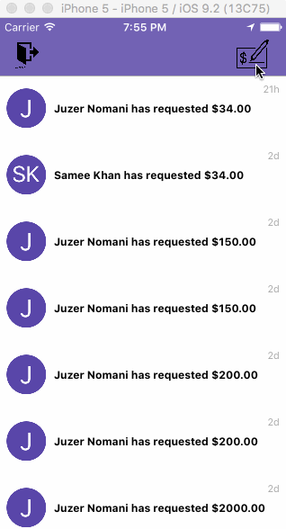

# Cartera
##Virginia Tech Hackathon 2016
###8th place

**Cartera** is a banking app using [Capital One's API](http://api.reimaginebanking.com/)
The app allows any user to become an ‘ATM’ for someone who needs instant cash. It works similar to how Uber works. Assume, I am a user of Cartera and I need $10 in cash ASAP but there are no ATMs nearby that I can use. Cartera will let me make my request for $10 and any other users nearby will be able to see my request and if another user decides to become my ATM then Cartera will set up some means of communication so that we can meetup and exchange money. During the exchange, I, the user
who needs the cash, must take a picture of the QR code shown on the other user, the teller in a sense, to be able to verify the meetup did happen. When the verification is done, the app will notify the teller that the electronic transfer was successful and that he/she may give the cash to the user who needed it.

Time spent: **35+** hours spent in total
## User Stories

The following **required** functionality is completed:

- [x] Signin page
- [x] Registration page
- [x] Main table view of requests of users in need of cash
- [x] Requesting view
- [x] Meetup view and code verification

## Video Walkthrough 

  Here's a walkthrough of implemented user stories:

  
  GIF created with [LiceCap](http://www.cockos.com/licecap/).
